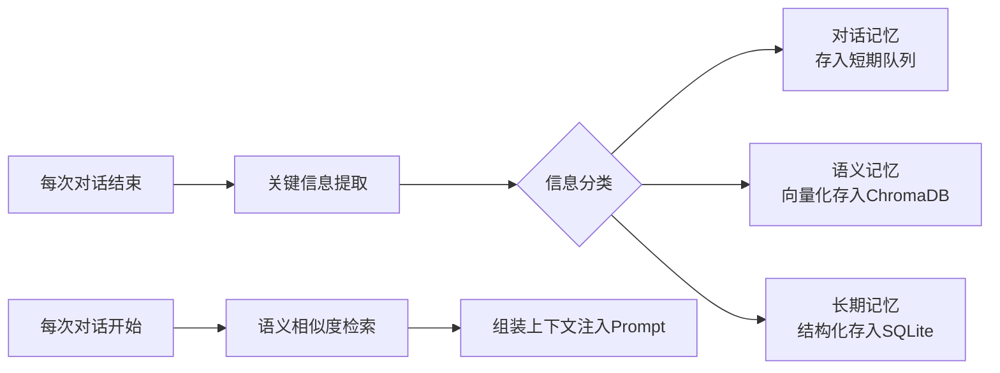

# AI智能模块 — 模块设计文档

> **模块名称**: AI智能模块 (AI Intelligence Module)  
> **所属项目**: 鸿蒙虚拟数字宠物 (HarmoPet)  
> **模块版本**: v1.0  
> **更新日期**: 2026-04-15

---

## 1. 模块概述

### 1.1 模块定位

AI智能模块是 HarmoPet 的**智慧大脑**，负责自然语言对话、语音交互、记忆管理、情绪共鸣和梦境生成。该模块采用 **Python FastAPI 后端 + ArkTS 北向客户端** 的架构，北向作为薄客户端调用AI后端能力。

### 1.2 模块职责

| 职责 | 说明 |
|------|------|
| AI对话 | 以宠物人格进行自然语言对话，支持上下文理解和个性化表达 |
| 语音交互 | Whisper语音识别 + Edge-TTS语音合成 + VAD端点检测 |
| 记忆系统 | 三层记忆架构（短期/语义/长期），永久存储互动内容 |
| 情绪共鸣 | 多源感知用户情绪，驱动宠物情绪同步响应 |
| 做梦系统 | 睡眠时基于当日记忆生成梦境，醒来后可分享 |

### 1.3 依赖关系

```
AI智能模块 (Python FastAPI 后端)
├── 依赖: LLM API (大语言模型接口)
├── 依赖: Whisper (本地离线语音识别)
├── 依赖: Edge-TTS (在线语音合成)
├── 依赖: ChromaDB / SQLite (向量库+关系数据库)
├── 被依赖: 北向应用 (ArkTS 客户端调用)
└── 被依赖: 核心宠物模块 (注入宠物状态到对话)
```

### 1.4 赛题合规说明

> **赛题硬性要求**：
> - "能够永久存储互动内容" → **三层记忆 + RDB双写机制**
> - "支持语音交流" → **Whisper识别 + Edge-TTS合成**
> - "情绪共鸣" → **多源情绪融合引擎**

---

## 2. AI对话子系统

### 2.1 功能描述

AI对话系统以虚拟宠物的身份与用户进行自然语言交流。通过Prompt工程注入宠物人格、性格、情绪状态、记忆等信息，确保对话的连贯性、个性化和情感深度。

#### 对话能力矩阵（MVP）

| 能力 | MVP版本 | 完整版 | 说明 |
|------|---------|--------|------|
| 自然对话 | P0 | ✅ | 以宠物视角日常聊天 |
| 上下文理解 | P0 | ✅ | 短期记忆保持对话连贯（最近10轮） |
| 个性化表达 | P1 | ✅ | 根据性格维度调整语气 |
| 情绪回应 | P1 | ✅ | 感知用户情绪后给出适当回应 |
| 主动关心 | P2 | ✅ | 宠物主动询问用户状态 |
| 知识问答 | P2 | ✅ | 简单百科问答（宠物视角） |

#### 对话人格Prompt模板（MVP）

```
你是{pet_name}，一只{pet_breed}虚拟宠物。
你的性格：开朗度{cheerful}/100，调皮度{naughty}/100...
你当前的心情：{current_mood}，精力值：{energy}/100
你与主人的亲密度：{intimacy}/100，处于{growth_stage}阶段。

记住以下关于主人的信息：
{user_profile_summary}

最近的互动记忆：
{recent_memories}

请以宠物的视角回复主人，保持角色一致性。
回复要简洁可爱（不超过50字），适当使用语气词。
```

### 2.2 接口定义

#### 北向 → AI后端：对话请求

```typescript
// ====== ArkTS 北向客户端调用 ======
// 文件路径: services/AIService.ets

export interface ChatRequest {
  /** 用户消息文本 */
  message: string;
  /** 会话ID（用于区分不同聊天会话） */
  sessionId: string;
  /** 当前宠物状态快照 */
  petState: {
    name: string;
    breed: string;
    mood: number;        // 心情值 0-100
    energy: number;      // 精力值 0-100
    emotion: string;     // 当前情绪类型
    intimacy: number;    // 亲密度 0-100
  };
  /** 当前性格快照 */
  personality?: Record<string, number>;
  /** 是否需要语音回复（同时返回TTS音频） */
  needVoice?: boolean;   // 默认 false
}
```

#### AI后端 → 北向：对话响应

```typescript
// ====== Python FastAPI 返回 ======

export interface ChatResponse {
  /** 是否成功 */
  success: boolean;
  /** 宠物回复文本 */
  reply: string;
  /** 回复中携带的情绪（用于更新宠物情绪） */
  emotion?: string;
  /** 本次对话是否触发了重要信息提取 */
  memoryExtracted?: boolean;
  /** TTS音频数据（Base64编码的MP3/WAV） */
  audioData?: string;      // Base64 encoded audio
  /** 音频格式 */
  audioFormat?: 'mp3' | 'wav';
  /** 音频时长(ms) */
  audioDurationMs?: number;
  /** 处理耗时(ms) - 用于性能监控 */
  processingTimeMs: number;
  /** 错误信息（失败时） */
  error?: string;
}
```

#### FastAPI 路由定义

```python
# 文件路径: ai-service/app/api/chat.py
from fastapi import APIRouter

router = APIRouter(prefix="/api/chat", tags=["chat"])

@router.post("/send", response_model=ChatResponse)
async def send_message(request: ChatRequest) -> ChatResponse:
    """
    发送消息给宠物AI
    
    - 接收用户消息
    - 注入宠物人格/记忆/情绪上下文
    - 调用LLM生成回复
    - 可选：生成TTS语音
    - 提取关键信息存入记忆
    """
    pass

@router.post("/history")
async def get_chat_history(
    session_id: str,
    limit: int = 50,
    offset: int = 0
) -> ChatHistoryResponse:
    """获取指定会话的聊天历史"""
    pass

@router.delete("/session/{session_id}")
async def clear_session(session_id: str) -> ClearResponse:
    """清除指定会话的短期记忆"""
    pass
```

### 2.3 参数说明

| 参数名 | 类型 | 必填 | 默认值 | 说明 |
|--------|------|------|--------|------|
| `message` | string | **是** | - | 用户输入的消息文本 |
| `sessionId` | string | **是** | - | 会话标识，用于关联同一轮对话历史 |
| `petState.name` | string | **是** | - | 宠物名字 |
| `petState.breed` | string | **是** | - | 品种: cat/dog/rabbit |
| `needVoice` | boolean | 否 | `false` | 是否同时返回TTS音频 |
| `limit` | integer | 否 | `50` | 获取历史条数上限 |

---

## 3. 语音交互子系统

### 3.1 功能描述

语音交互子系统实现"按住说话→语音识别→AI理解→语音回复"的完整链路。MVP版本使用Whisper本地识别 + Edge-TTS在线合成。

#### 交互流程

```
┌───────┐    ┌───────┐    ┌─────────┐    ┌──────┐    ┌───────┐    ┌───────┐
│ 按住   │    │ VAD   │    │ Whisper │    │ LLM   │    │Edge   │    │ 播放   │
│ 说话   │───→│端点   │───→│ 语音    │───→│ 生成   │───→│ TTS   │───→│ 音频   │
│       │    │检测   │    │ 识别    │    │ 回复   │    │ 合成   │    │       │
└───────┘    └───────┘    └─────────┘    └──────┘    └───────┘    └───────┘
   用户          本地         本地           服务端        在线         北向
```

#### 语音特性配置

| 特性 | 技术方案 | MVP优先级 | 说明 |
|------|----------|-----------|------|
| 语音识别 | Whisper (local/offline) | **P0** | 支持中英文，模型: base/small |
| 语音合成 | Edge-TTS (online) | **P0** | 多音色可选，延迟低 |
| VAD端点检测 | silero-vad (local) | **P0** | 自动判断说话结束 |
| 声音风格选择 | 根据宠物品种映射 | P1 | 猫→软萌女声, 狗→活力男声 |
| 语音缓存 | Redis/Memory缓存 | P1 | 高频回复预合成，减少延迟 |

#### 音色映射表

| 宠物品种 | Edge-TTS角色 | 风格描述 |
|----------|-------------|----------|
| 小猫(cat) | `zh-CN-XiaoyiNeural` | 软萌温柔，年轻女性 |
| 小狗(dog) | `zh-CN-YunxiNeural` | 活泼元气，年轻男性 |
| 小兔(rabbit) | `zh-CN-XiaoxiaoNeural` | 轻柔安静，年轻女性 |

### 3.2 接口定义

#### 语音识别请求/响应

```python
# 文件路径: ai-service/app/api/voice.py
from fastapi import APIRouter, UploadFile

router = APIRouter(prefix="/api/voice", tags=["voice"])

class STTRequest:
    """语音转文字请求"""
    audio_file: UploadFile       # WAV/PCM格式的音频文件
    language: str = "zh"         # 语言: zh/en/auto
    model_size: str = "base"     # Whisper模型: base/small/medium

class STTResponse:
    """语音转文字响应"""
    success: bool
    text: str                    # 识别出的文字
    confidence: float            # 识别置信度 0-1
    language: str                # 检测到的语言
    duration_ms: int             # 音频时长(ms)
    processing_time_ms: int      # 处理耗时(ms)

@router.post("/stt", response_model=STTResponse)
async def speech_to_text(request: STTRequest) -> STTResponse:
    """语音识别：接收音频文件，返回识别文字"""
    pass


class TTSRequest:
    """文字转语音请求"""
    text: str                    # 要合成的文本
    voice: str = "zh-CN-XiaoyiNeural"  # Edge-TTS音色
    rate: str = "+0%"            # 语速调整
    pitch: str = "+0Hz"          # 音调调整

class TTSResponse:
    """文字转语音响应"""
    success: bool
    audio_data: str              # Base64编码的音频数据 (MP3)
    audio_format: str = "mp3"
    duration_ms: int             # 音频时长(ms)

@router.post("/tts", response_model=TTSResponse)
async def text_to_speech(request: TTSRequest) -> TTSResponse:
    """语音合成：接收文本，返回音频流"""
    pass
```

#### 北向语音服务封装

```typescript
// 文件路径: services/VoiceService.ets

export class VoiceService {
  private static instance: VoiceService;
  
  public static getInstance(): VoiceService
  
  // ---------- 录制 ----------
  /**
   * 开始录音（按住说话）
   * @returns 录音任务ID
   */
  startRecording(): Promise<string>
  
  /**
   * 停止录音并自动发送识别+对话
   * @param taskId 录音任务ID
   * @returns 包含AI回复和音频的完整结果
   */
  async stopAndSend(taskId: string): Promise<VoiceChatResult>
  
  // ---------- 播放 ----------
  /**
   * 播放TTS回复音频
   * @param audioData Base64编码的音频数据
   * @param format 音频格式
   */
  playAudio(audioData: string, format: 'mp3' | 'wav'): Promise<void>
  
  /** 停止播放 */
  stopPlayback(): void
}

export interface VoiceChatResult {
  recognizedText: string;       // 识别出的文字
  chatResponse: ChatResponse;   // AI对话响应（含audioData）
}
```

### 3.3 参数说明

| 参数名 | 类型 | 必填 | 默认值 | 说明 |
|--------|------|------|--------|------|
| `audio_file` | file | **是** | - | WAV/PCM格式音频，采样率16kHz+ |
| `language` | string | 否 | `"zh"` | 代码: zh(中文) / en(英文) / auto(自动) |
| `model_size` | string | 否 | `"base"` | 模型大小: base(~75MB)/small(~250MB) |
| `text` | string | **是** | - | 待合成文本（建议≤200字） |
| `voice` | string | 否 | 见映射表 | Edge-TTS角色名 |
| `rate` | string | 否 | `"+0%"` | 语速: -50%~+100% |
| `pitch` | string | 否 | `"+0Hz"` | 音调: -10Hz~+10Hz |

---

## 4. 记忆子系统

### 4.1 功能描述

记忆系统是 HarmoPet 的核心差异化功能，采用**三层记忆架构**实现互动内容的永久存储。每层记忆有不同的生命周期、存储方式和用途。

> ⚠️ **赛题合规核心**：本系统满足赛题"能够永久存储互动内容"的要求，采用 **RDB本地永久存储 + AI后端双层持久化** 方案。

#### 三层记忆架构

```
┌─────────────────────────────────────────────────────┐
│  Layer 1: 短期记忆 (Working Memory)                 │
│  存储: 内存队列 (最近N轮对话)                         │
│  生命周期: 会话级                                    │
│  用途: 保持对话上下文连贯                             │
│           ↓ 每10轮或会话结束时自动压缩               │
├─────────────────────────────────────────────────────┤
│  Layer 2: 语义记忆 (Semantic Memory)                │
│  存储: ChromaDB 向量数据库                          │
│  生命周期: 永久（可检索）                            │
│  用途: 语义相似度检索相关记忆                        │
│           ↓ 定期摘要归档                             │
├─────────────────────────────────────────────────────┤
│  Layer 3: 长期记忆 (Long-term Memory)               │
│  存储: SQLite 关系数据库                            │
│  生命周期: 永久                                      │
│  用途: 用户画像/成长记录/关键事件                    │
└─────────────────────────────────────────────────────┘
```

#### 记忆类型详细定义

| 记忆类型 | 北向存储(RDB) | AI后端存储 | 保留时长 | 示例 |
|----------|---------------|------------|----------|------|
| 对话记忆 | `chat_history` 表 | 内存队列 | 当前会话+永久归档 | "主人刚才说想去旅游" |
| 语义记忆 | `interaction_log` 表 | ChromaDB向量库 | 永久(可检索) | "主人喜欢猫不喜欢狗" |
| 长期记忆 | `pet_growth` 表 | SQLite | 永久 | "主人的生日是3月15日" |
| 情感记忆 | `emotion_record` 表 | 关联存储 | 永久 | "上次主人哭的时候我安慰了ta" |
| 行为记忆 | `interaction_log` 表 | 统计聚合 | 永久 | "主人每天晚上10点来" |

#### 记忆操作流程



#### 用户画像自动构建

```typescript
// 用户画像数据结构
interface UserProfile {
  basicInfo: {
    nickname: string;       // 昵称
    birthday?: string;      // 生日
    occupation?: string;    // 职业
  };
  preferences: {
    favoriteFoods: string[];     // 喜欢的食物
    petPreference: string;       // 猫派/狗派/都喜欢
    sleepSchedule: string;       // 作息规律
  };
  emotionalPatterns: {
    stressfulPeriods: string[];  // 压力时段
    happinessTriggers: string[]; // 开心触发点
    comfortMethods: string[];    // 安慰方式
  };
  interactionHabits: {
    activeHours: string[];       // 活跃时段
    avgDailyInteractions: number;// 日均互动次数
    preferredTypes: string[];    // 偏好互动类型
  };
  importantEvents: Array<{
    date: string;
    event: string;
    sentiment: 'positive' | 'negative' | 'neutral';
  }>;
}
```

### 4.2 接口定义

#### 记忆操作API（FastAPI）

```python
# 文件路径: ai-service/app/api/memory.py
from fastapi import APIRouter
from pydantic import BaseModel
from typing import List, Optional

router = APIRouter(prefix="/api/memory", tags=["memory"])

# ---------- 存储接口 ----------

class StoreMemoryRequest(BaseModel):
    """存储一条新记忆"""
    content: str               # 记忆内容原文
    memory_type: str           # 类型: dialog | semantic | long_term | emotional | behavioral
    source_session_id: str     # 来源会话ID
    metadata: dict = {}        # 附加元数据
    importance: float = 0.5    # 重要程度 0-1

class StoreMemoryResponse(BaseModel):
    success: bool
    memory_id: str             # 生成的记忆唯一ID

@router.post("/store", response_model=StoreMemoryResponse)
async def store_memory(req: StoreMemoryRequest) -> StoreMemoryResponse:
    """存储一条新记忆（自动分类+路由到对应层级）"""
    pass


# ---------- 检索接口 ----------

class SearchMemoryRequest(BaseModel):
    query: str                 # 检索查询（自然语言）
    memory_types: Optional[List[str]] = None  # 限定记忆类型
    limit: int = 10            # 返回数量上限
    min_similarity: float = 0.3 # 最小相似度阈值

class MemoryItem(BaseModel):
    memory_id: str
    content: str
    memory_type: str
    similarity: float          # 与查询的相似度
    created_at: str            # 创建时间
    metadata: dict

class SearchMemoryResponse(BaseModel):
    success: bool
    results: List[MemoryItem]

@router.post("/search", response_model=SearchMemoryResponse)
async def search_memory(req: SearchMemoryRequest) -> SearchMemoryResponse:
    """语义搜索相关记忆"""
    pass


# ---------- 用户画像接口 ----------

class UserProfileResponse(BaseModel):
    profile: UserProfile       # 完整用户画像
    last_updated: str

@router.get("/user-profile", response_model=UserProfileResponse)
async def get_user_profile() -> UserProfileResponse:
    """获取自动构建的用户画像"""
    pass


# ---------- 压缩接口 ----------

@router.post("/compress")
async function compress_short_term_memory(session_id: str):
    """
    触发短期记忆压缩
    - 将超过10轮的对话摘要为语义记忆
    - 清理已归档的短期记录
    """
    pass
```

#### 北向记忆服务封装

```typescript
// 文件路径: services/MemoryService.ets

export class MemoryService {
  private static instance: MemoryService;
  
  public static getInstance(): MemoryService
  
  // ---------- 便捷方法 ----------
  
  /**
   * 一次完整的"存入+检索"流程（供对话系统调用）
   * @param userMessage 用户最新消息
   * @param petReply 宠物回复
   * @param sessionId 会话ID
   */
  async processDialogTurn(
    userMessage: string,
    petReply: string,
    sessionId: string
  ): Promise<SearchMemoryResponse>
  
  /**
   * 获取带记忆注入的对话上下文
   * 用于在发起新对话时组装完整Prompt
   */
  async getConversationContext(sessionId: string): Promise<string>
}
```

### 4.3 参数说明

| 参数名 | 类型 | 必填 | 默认值 | 说明 |
|--------|------|------|--------|------|
| `content` | string | **是** | - | 记忆原始内容 |
| `memory_type` | string | **是** | - | 5种记忆类型之一 |
| `importance` | float | 否 | `0.5` | 重要程度，影响长期保留权重 |
| `query` | string | **是** | - | 自然语言检索查询 |
| `limit` | integer | 否 | `10` | 返回结果上限 |
| `min_similarity` | float | 否 | `0.3` | 相似度过滤阈值 0~1 |

---

## 5. 情绪共鸣子系统

### 5.1 功能描述

情绪共鸣子系统实现从多个渠道感知用户当前的情绪状态，并驱动宠物做出相应的情绪和行为回应。这是赛题"情绪共鸣"要求的核心实现。

#### 多源情绪感知方案

| 感知源 | 技术方式 | 精度 | 数据来源 | MVP优先级 |
|--------|----------|------|----------|-----------|
| 文字情绪 | LLM语义分析 | 高 | 用户聊天文字 | **P0** |
| 语音语调 | 语音情感分析API | 中 | 录音音频特征 | P1 |
| 交互行为 | 操作频率/类型分析 | 低 | 互动日志统计 | **P1** |
| 面部表情 | 摄像头+表情分析API | 中 | 前置摄像头采集 | P2 |

#### 共鸣策略映射表

| 用户情绪 | 宠物反应动作 | 宠物气泡示例 | 属性影响 | MVP |
|----------|-------------|-------------|----------|-----|
| 😄 开心 | 转圈跳跃 | "主人开心我也好开心呀~！" | 心情+5 | P0 |
| 😢 难过 | 靠近蹭人 | "主人别难过，我陪着你..." | 亲密度+2 | P0 |
| 😠 生气 | 躲闪低头 | "唔...主人消消气..." | 无 | P1 |
| 😰 焦虑 | 摇尾巴安慰 | "没事的没事的，有我在呢~" | 心情+3 | P1 |
| 😴 疲惫 | 安静陪伴 | "主人累了就休息吧，我守着你" | 无 | P1 |

### 5.2 接口定义

```python
# 文件路径: ai-service/app/api/emotion.py
from fastapi import APIRouter
from pydantic import BaseModel
from typing import Optional
from enum import Enum

router = APIRouter(prefix="/api/emotion", tags=["emotion"])

class UserEmotion(str, Enum):
    HAPPY = "happy"
    SAD = "sad"
    ANGRY = "angry"
    ANXIOUS = "anxious"
    TIRED = "tired"
    NEUTRAL = "neutral"

class AnalyzeTextEmotionRequest(BaseModel):
    text: str                   # 用户输入的文字
    context: Optional[str] = None # 上下文（前几轮对话）

class EmotionAnalysisResult(BaseModel):
    primary_emotion: UserEmotion     # 主导情绪
    confidence: float                # 置信度 0-1
    emotions_scores: dict            # 各维度得分 {"happy": 0.8, "sad": 0.1, ...}
    suggested_pet_response: str      # 建议的宠物反应策略

@router.post("/analyze-text", response_model=EmotionAnalysisResult)
async def analyze_text_emotion(req: AnalyzeTextEmotionRequest) -> EmotionAnalysisResult:
    """分析文字中的用户情绪（基于LLM语义分析）"""
    pass


class AnalyzeBehaviorEmotionRequest(BaseModel):
    recent_interactions: list    # 最近N次互动记录 [{type, time, ...}]
    time_window_hours: float = 1 # 分析时间窗口(小时)

@router.post("/analyze-behavior", response_model=EmotionAnalysisResult)
async def analyze_behavior_emotion(req: AnalyzeBehaviorEmotionRequest) -> EmotionAnalysisResult:
    """基于用户行为模式推断情绪"""
    pass
```

### 5.3 参数说明

| 参数名 | type | 必填 | 默认值 | 说明 |
|--------|------|------|--------|------|
| `text` | string | **是** | - | 待分析的文字内容（建议≤500字） |
| `context` | string | 否 | `null` | 前几轮对话摘要，提高准确率 |
| `recent_interactions` | array | **是** | - | 近期互动记录列表 |
| `time_window_hours` | float | 否 | `1.0` | 行为分析的时间窗口大小 |

---

## 6. 做梦子系统

### 6.1 功能描述

做梦系统在宠物睡眠期间，基于当日的互动记忆和情绪状态，利用LLM生成独特的梦境脚本。宠物醒来后可以主动向用户讲述梦境内容，增加情感连接深度。

#### 做梦流程

```
宠物进入睡眠状态
    │
    ▼
收集当日记忆 → 提取关键事件 + 主导情绪
    │
    ▼
LLM生成梦境脚本（根据梦境类型模板）
    │
    ▼
可选: AI绘图生成梦境插图 (P2)
    │
    ▼
存入梦境日记 (SQLite永久存储)
    │
    ▼
宠物醒来 → 主动告诉用户梦境内容
```

#### 梦境类型与触发条件

| 类型 | 触发条件 | 内容风格 | 气泡示例 | MVP |
|------|----------|----------|----------|-----|
| 快乐梦 | 当日心情>80 | 温馨愉快 | "我梦到和主人在草地上奔跑~" | **P0** |
| 回忆梦 | 当日有重要事件 | 怀旧感怀 | "梦到你第一次领养我的样子" | P1 |
| 奇幻梦 | 随机触发(20%) | 天马行空 | "我变成了超级英雄！" | P1 |
| 焦虑梦 | 当日心情<30 | 不安紧张 | "呜...梦到你不要我了..." | P1 |
| 美食梦 | 饥饿时入睡 | 趣味搞笑 | "梦里全是吃不完的小鱼干！" | P2 |

### 6.2 接口定义

```python
# 文件路径: ai-service/app/api/dream.py
from fastapi import APIRouter
from pydantic import BaseModel
from typing import Optional
from datetime import datetime

router = APIRouter(prefix="/api/dream", tags=["dream"])

class GenerateDreamRequest(BaseModel):
    pet_name: string                     # 宠物名字
    daily_mood_avg: float                # 当日平均心情 0-100
    key_events: list[str]                # 当日关键事件列表
    current_emotion: string              # 当前主导情绪
    include_illustration: bool = False   # 是否生成AI绘图(P2)

class DreamRecord(BaseModel):
    dream_id: str                        # 梦境唯一ID
    date: str                            # 日期 YYYY-MM-DD
    dream_type: string                   # 梦境类型
    title: string                        # 梦境标题
    content: str                         # 梦境描述文本
    illustration_url: Optional[str]      # AI绘图URL(P2)
    emotion_before: string               # 入睡时情绪
    emotion_after waking: string         # 醒后情绪
    created_at: str                      # 生成时间戳

class GenerateDreamResponse(BaseModel):
    success: bool
    dream: DreamRecord
    bubble_text: str                     # 醒后告诉主人的气泡文本

@router.post("/generate", response_model=GenerateDreamResponse)
async function generate_dream(req: GenerateDreamRequest) -> GenerateDreamResponse:
    """生成一次梦境"""
    pass


class DreamJournalResponse(BaseModel):
    dreams: list[DreamRecord]
    total: int

@router.get("/journal")
async function get_dream_journal(limit: int = 30) -> DreamJournalResponse:
    """获取梦境日记（全部历史记录）"""
    pass
```

#### 北向做梦服务封装

```typescript
// 文件路径: services/DreamService.ets

export class DreamService {
  private static instance: DreamService;
  
  public static getInstance(): DreamService
  
  /**
   * 触发做梦流程（在宠物睡眠结束时调用）
   * @param options 做梦所需上下文
   */
  async triggerDream(options: DreamContext): Promise<DreamRecord>
  
  /**
   * 获取梦境日记（用于梦境日记页面展示）
   */
  async getJournal(limit?: number): Promise<DreamRecord[]>
}

export interface DreamContext {
  petName: string;
  dailyMoodAvg: number;
  keyEvents: string[];
  currentEmotion: string;
}
```

### 6.3 参数说明

| 参数名 | type | 必填 | 默认值 | 说明 |
|--------|------|------|--------|------|
| `daily_mood_avg` | float | **是** | - | 当日心情平均值 0~100 |
| `key_events` | string[] | **是** | - | 当日重要事件文本列表 |
| `include_illustration` | boolean | 否 | `false` | 是否额外调用AI绘图（耗时较长） |
| `limit` | integer | 否 | `30` | 日记查询条数上限 |

---

## 7. AI服务降级策略

### 7.1 降级场景处理

AI服务可能因网络问题不可用，必须设计完善的降级策略保证基本体验：

| 场景 | 正常模式 | 降级模式 | 降级优先级 |
|------|----------|----------|-----------|
| AI对话不可用 | LLM实时生成回复 | **预设回复池**随机选取 | 必须实现 |
| TTS不可用 | Edge-TTS在线合成 | **降级为纯文字**显示 | 必须接受 |
| STT不可用 | Whisper本地识别 | **仅支持文字输入** | 必须接受 |
| 记忆服务不可用 | ChromaDB向量检索 | **仅用RDB本地存储** | 必须实现 |
| 做梦系统不可用 | LLM生成梦境 | **跳过本次梦境**，恢复后补做 | 可接受 |
| 情绪分析不可用 | LLM多源分析 | **仅基于属性值判断** | 必须实现 |

### 7.2 预设回复池（MVP必备）

```typescript
// 文件路径: resources/fallback_responses.json

const FALLBACK_RESPONSES: Record<string, string[]> = {
  // 通用回复（无上下文时随机选）
  default: [
    "嗯嗯，主人说什么呢？",
    "我在听呢~",
    "主人想聊什么呀？",
    "喵~",
  ],
  // 问候类
  greeting: [
    "主人回来啦！我想你了~",
    "嗨主人！今天过得怎么样？",
  ],
  // 情绪回应类
  happy_response: [
    "太好了！主人开心我就开心！",
    "哇！那真是太棒了~",
  ],
  sad_response: [
    "主人...别难过，我陪着你。",
    "摸摸头，一切都会好起来的~",
  ],
};
```

---

## 8. MVP最小可用版本清单

### 8.1 Phase 2 AI-MVP 核心功能

| 功能点 | 子项 | 优先级 | 说明 |
|--------|------|--------|------|
| **AI对话** | LLM接入 + Pet人格Prompt | **P0** | 核心体验，必须可用 |
| **对话上下文** | 短期记忆维持最近10轮 | **P0** | 保证对话连贯 |
| **语音识别** | Whisper base模型 | **P0** | 支持中文语音输入 |
| **语音合成** | Edge-TTS | **P0** | 支持语音回复播放 |
| **VAD端点检测** | silero-vad | **P0** | 自动判断说话结束 |
| **基础记忆** | 对话记录RDB存储 | **P0** | 赛题合规：永久存储互动内容 |
| **预设回复池** | 20+条分类预设回复 | **P0** | AI不可用时的降级方案 |
| **文字情绪分析** | LLM分析用户文字情绪 | **P0** | 情绪共鸣的基础实现 |
| **做梦系统** | 基础梦境生成(快乐梦/焦虑梦) | **P0** | 特色功能亮点 |

### 8.2 MVP 可选增强

| 功能点 | 优先级 | 说明 |
|--------|--------|------|
| 语义记忆(ChromaDB) | P1 | 向量检索增强记忆召回 |
| 长期记忆+用户画像 | P1 | 自动构建用户画像 |
| 记忆压缩器 | P1 | 短期→语义记忆自动压缩 |
| 语音情绪分析 | P1 | 从语音特征分析情绪 |
| AI梦境绘图 | P2 | 为梦境生成配图 |
| 语音预合成缓存 | P2 | 减少高频回复延迟 |

---

## 9. 文件结构

```
ai-service/                              # Python FastAPI 后端
├── app/
│   ├── main.py                          # FastAPI入口
│   ├── config.py                        # 配置管理(API Key/地址等)
│   ├── api/
│   │   ├── chat.py                      # 对话API路由
│   │   ├── voice.py                     # 语音API路由
│   │   ├── emotion.py                   # 情绪API路由
│   │   ├── dream.py                     # 做梦API路由
│   │   └── memory.py                    # 记忆API路由
│   ├── agent/
│   │   ├── pet_agent.py                 # LLM宠物Agent核心
│   │   ├── prompt_templates.py          # Prompt模板库
│   │   └── tool_calls.py                # 工具调用定义
│   ├── memory/
│   │   ├── short_term.py                # 短期记忆(内存队列)
│   │   ├── semantic.py                  # 语义记忆(ChromaDB)
│   │   ├── long_term.py                 # 长期记忆(SQLite)
│   │   └── compressor.py                # 记忆压缩器
│   ├── tts/
│   │   ├── edge_tts_engine.py           # Edge-TTS合成引擎
│   │   ├── cache.py                     # 语音缓存
│   │   └── player.py                    # 播放管理
│   ├── stt/
│   │   ├── whisper_engine.py            # Whisper识别引擎
│   │   └── vad.py                       # VAD端点检测
│   ├── emotion/
│   │   ├── detector.py                  # 情绪检测器
│   │   ├── analyzer.py                  # 情绪分析器
│   │   └── response.py                  # 共鸣响应策略
│   └── dream/
│       ├── generator.py                 # 梦境生成(LLM)
│       ├── illustrator.py              # AI绘图(P2)
│       └── journal.py                   # 梦境日记管理
├── data/                                # 持久化数据目录
│   ├── chroma_db/                       # ChromaDB向量库数据
│   ├── memories.db                      # SQLite长期记忆数据库
│   └── fallback_responses.json          # 预设回复池
├── requirements.txt                     # Python依赖
└── README.md

entry/src/main/ets/                        # ArkTS 北向客户端
├── services/
│   ├── AIService.ets                     # AI总服务(封装HTTP调用)
│   ├── VoiceService.ets                  # 语音录制/播放服务
│   ├── MemoryService.ets                 # 记忆服务封装
│   └── DreamService.ets                  # 做梦服务封装
├── pages/
│   └── ChatPage.ets                      # 聊天界面页
└── resources/
    └── fallback_responses.json           # 预设回复池(本地备份)
```
